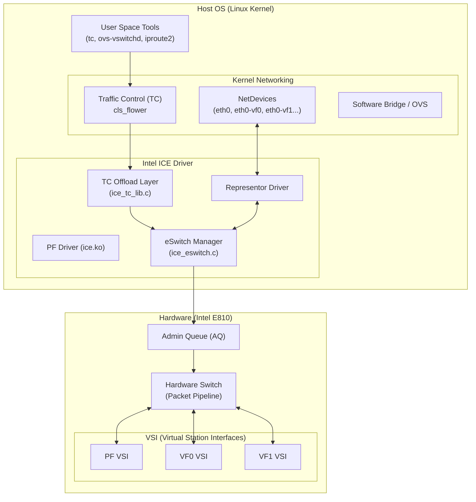

# Linux Switchdev 架構深度解析：Intel ICE Driver 實戰指南

## 1. Executive Summary & Architecture Overview

### 1.1 為什麼需要 Switchdev？

在傳統的 SR-IOV 模式（Legacy Mode）中，網卡運作得像一個黑盒子。雖然硬體內部有一個高效的 Layer 2 Switch (VEB - Virtual Ethernet Bridge)，但 Linux Kernel 對其一無所知。
*   **不可視 (Invisible)**: Host OS 看不到 VF 之間的流量。
*   **不可控 (Uncontrollable)**: 無法使用標準的 Linux 工具 (`tc`, `iptables`, `bridge`) 來管理 VF 流量。
*   **功能受限**: 無法實現複雜的轉發邏輯（如 OVS 的 Flow Table）。

**Switchdev** 框架的出現改變了這一切。它將硬體交換機的 "控制權" 上交給 Linux Kernel，同時保留硬體的 "轉發能力"。
*   **Representor 模型**: 每個 VF 在 Host 上都有一個對應的虛擬網卡 (`eth0-vf0`)，稱為 Port Representor。
*   **Offload 模型**: Linux 制定轉發規則 (Control Plane)，硬體執行轉發 (Data Plane)。

### 1.2 架構方塊圖 (High-Level Architecture)



---

## 2. Core Data Structures (核心數據結構)

在 Switchdev 模式下，驅動維護了幾個關鍵對象。理解它們的關係是閱讀代碼的基礎。

### 2.1 `struct ice_pf` (Physical Function)
這是驅動的根對象，代表物理網卡。在 Switchdev 模式下，它包含了 eSwitch 的管理結構。

```c
struct ice_pf {
    struct pci_dev *pdev;
    struct ice_hw hw;
    
    // SR-IOV 管理
    struct ice_vfs vfs;             // 包含所有 VF 的 Hash Table
    
    // Switchdev 核心結構
    struct ice_eswitch {
        struct ice_vsi *control_vsi;    // 用於處理 Slow Path 流量的 VSI
        struct ice_vsi *uplink_vsi;     // 物理鏈路 VSI
        struct xarray reprs;            // 存放所有 Port Representor 的數組
        bool is_running;                // Switchdev 模式是否激活
    } eswitch;
};
```

### 2.2 `struct ice_vf` (Virtual Function)
代表一個 SR-IOV 虛擬函數。這是硬體 VF 的軟體抽象。

```c
struct ice_vf {
    u16 vf_id;                      // VF ID (0 ~ 255)
    struct ice_pf *pf;              // Backpointer to PF
    
    // 關鍵資源索引
    u16 lan_vsi_idx;                // VF 的數據平面 VSI 索引
    u16 ctrl_vsi_idx;               // 控制通道 VSI
    
    // Switchdev 關聯
    struct ice_repr *repr;          // 指向對應的 Representor (如果存在)
    
    // 狀態位
    unsigned long vf_caps;          // TRUSTED, SPOOFCHK 等能力
    DECLARE_BITMAP(vf_states, ...); // ACTIVE, RESETTING 等狀態
};
```

### 2.3 `struct ice_repr` (Port Representor)
這是 Switchdev 的靈魂。它是一個標準的 `net_device`，但在底層，它代表了 Switch 的一個虛擬端口。

```c
struct ice_repr {
    struct net_device *netdev;      // Linux 網絡設備 (如 eth0-vf0)
    struct ice_vf *vf;              // 指向它代表的 VF
    struct ice_vsi *src_vsi;        // 流量來源 VSI (即 VF 的 VSI)
    
    // 轉發邏輯需要的 Metadata
    struct metadata_dst *dst;       
    u16 id;                         // Representor ID
};
```

### 2.4 `struct ice_vsi` (Virtual Station Interface)
硬體隊列集合的抽象。在 E810 架構中，一切皆 VSI。
*   **PF VSI**: 處理 Host 網絡流量。
*   **VF VSI**: 處理 VM/Container 流量。
*   **Control VSI**: Switchdev 模式下，用於攔截並處理未命中規則的異常流量 (Slow Path)。

---

## 3. Lifecycle Management (生命週期管理)

Switchdev 的生命週期比傳統 SR-IOV 複雜，因為它涉及了 "模式切換" 和 "Representor 創建"。

### 3.1 VF 的誕生 (The Birth of VFs)
這是基礎，無論是否使用 Switchdev 都會發生。

**Command**: `echo 4 > /sys/class/net/eth0/device/sriov_numvfs`

**Flow**:
1.  **Kernel**: `pci_enable_sriov()` 寫入 PCIe SR-IOV Capability。
2.  **Driver**: `ice_sriov_configure()` -> `ice_pci_sriov_ena()`。
3.  **Resource Alloc**: `ice_set_per_vf_res()` 計算每個 VF 的 MSI-X 和 Queue 配額。
4.  **Hardware Init**: `ice_ena_vf_mappings()` 寫入 `VPINT_ALLOC`, `VPLAN_TXQ_MAPENA` 等寄存器。
5.  **Result**: 此時，4 個 VF 設備在 PCIe 總線上出現，但它們處於 Legacy 模式 (VEB)。

### 3.2 切換到 Switchdev 模式 (Mode Switch)
這是關鍵轉折點。

**Command**: `devlink dev eswitch set pci/0000:01:00.0 mode switchdev`

**Code Flow (`ice_eswitch.c`)**:
1.  **Entry**: `ice_eswitch_mode_set()` 被 devlink 子系統調用。
2.  **Check**: 檢查是否有 VF 已經綁定驅動 (通常要求解綁或支持即時切換)。
3.  **Enable Control VSI**: `ice_eswitch_setup_env()`
    *   創建一個特殊的 Control VSI。
    *   配置硬體 Rule：將所有 "Miss" (未匹配) 的流量導向這個 Control VSI。這確保了 Slow Path 流量能回到 PF 驅動處理。
4.  **Create Representors**: `ice_eswitch_remap_rings_and_create_reprs()`
    *   遍歷所有現存的 VF。
    *   為每個 VF 調用 `ice_repr_add()`。

### 3.3 Representor 的創建 (`ice_repr_add`)

```c
int ice_repr_add(struct ice_vf *vf)
{
    // 1. 分配 net_device
    struct net_device *netdev = alloc_etherdev(sizeof(struct ice_repr));
    
    // 2. 設置 netdev 操作函數
    netdev->netdev_ops = &ice_repr_netdev_ops; // 關鍵！定義了 open, stop, start_xmit
    netdev->ethtool_ops = &ice_repr_ethtool_ops;
    
    // 3. 設置 Switchdev 操作
    netdev->switchdev_ops = &ice_repr_switchdev_ops; // 用於處理 switchdev 屬性
    
    // 4. 關聯 VF
    repr->vf = vf;
    vf->repr = repr;
    
    // 5. 註冊到 Kernel
    register_netdev(netdev);
    
    // 6. 設置為 "Port" (Devlink Port)
    devlink_port_type_eth_set(&vf->devlink_port, netdev);
}
```

### 3.4 銷毀流程 (Teardown)

當切換回 Legacy 模式 (`mode legacy`) 或刪除 VF 時：
1.  **Unregister Netdev**: `unregister_netdev(repr->netdev)`。
2.  **Detach**: 斷開 `vf->repr` 指針。
3.  **Free**: 釋放 `struct ice_repr` 內存。
4.  **Restore Hardware**: 移除 Control VSI 規則，恢復 VEB 默認轉發行為。

---
## 4. Control Plane: From TC to Hardware (控制平面)

在 Switchdev 模式下，Linux TC (Traffic Control) 是主要的控制接口。我們將追蹤一條 Offload 規則是如何從用戶空間下發到網卡硬體的。

### 4.1 用戶空間命令 (User Space)

```bash
# 規則：將從 VF0 (eth0-vf0) 進入的 IP 封包，轉發到 VF1 (eth0-vf1)
tc filter add dev eth0-vf0 ingress protocol ip flower skip_sw action mirred egress redirect dev eth0-vf1
```

*   `protocol ip flower`: 使用 Flower 分類器匹配 IP 協議。
*   `skip_sw`: **關鍵標誌**。告訴 Kernel "這條規則必須卸載到硬體，如果硬體不支持則報錯"。這保證了純硬體轉發。
*   `action mirred egress redirect`: 動作是鏡像並重定向。

### 4.2 Kernel 處理流程 (Kernel Space)

1.  **Netlink 解析**: Kernel 收到 Netlink 消息，解析為 `struct tcf_proto` 和 `struct tcf_chain`。
2.  **Switchdev 通知**: Kernel 遍歷所有註冊了 `ndo_setup_tc` 的設備。
3.  **Driver Entry**: `ice_repr_setup_tc()` 被調用。

```c
static int ice_repr_setup_tc(struct net_device *netdev, enum tc_setup_type type, void *type_data)
{
    struct ice_repr *repr = netdev_priv(netdev);
    
    switch (type) {
    case TC_SETUP_CLSFLOWER:
        return ice_add_cls_flower(repr->netdev, repr->vf, type_data);
    default:
        return -EOPNOTSUPP;
    }
}
```

### 4.3 Driver 轉換邏輯 (`ice_tc_lib.c`)

驅動必須將 Linux 的通用 Flow 描述轉換為硬體能理解的 Profile 和 Rule。

**函數**: `ice_add_cls_flower()`

1.  **解析 Flow**: `ice_tc_parse_flower()`
    *   提取 Match Key: `ETH_TYPE = IP`, `SRC_PORT = VF0_VSI`.
    *   提取 Action: `REDIRECT_TO_VSI = VF1_VSI`.
2.  **資源檢查**: 檢查硬體表空間是否足夠。
3.  **構建硬體規則**: `ice_add_adv_rule()`。

### 4.4 硬體編程 (Hardware Programming)

這是最底層的步驟，驅動通過 Admin Queue (AQ) 與 Firmware 通信。

**關鍵結構**: `struct ice_adv_rule_info`

```c
struct ice_adv_rule_info {
    enum ice_sw_tunnel_type tun_type; // 隧道類型 (如 VXLAN)
    struct ice_sw_act_ctrl sw_act;    // 動作 (Forward, Drop)
    u16 vsi_handle;                   // 目標 VSI
    // ...
};
```

**AdminQ 命令**: `ice_aq_add_recipe` 和 `ice_aq_add_rule`
*   **Recipe (食譜)**: 定義 "怎麼查表"。例如："先查 MAC，再查 IP"。E810 支持動態創建 Recipe。
*   **Rule (規則)**: 定義 "查什麼值"。例如："MAC=AA:BB:CC, IP=1.2.3.4"。

**最終結果**: Firmware 更新 Switch Block 的 TCAM/SRAM 表項。下次封包到達時，硬體 Pipeline 直接命中該規則，執行轉發。

---

## 5. SR-IOV Integration & Management (SR-IOV 整合管理)

Switchdev 模式下，SR-IOV 的管理方式發生了現代化轉變。

### 5.1 Legacy vs Modern Management

| 特性 | Legacy Mode (ip link) | Modern Mode (devlink) |
| :--- | :--- | :--- |
| **命令示例** | `ip link set eth0 vf 0 mac ...` | `devlink port function set ...` |
| **MAC 配置** | 僅設置 VF 的默認 MAC | 可配置 SF (Subfunction) 和 Port 屬性 |
| **VLAN 配置** | `ip link set ... vlan 100` | 通過 `bridge vlan` 命令配置 Representor |
| **狀態查看** | `ip link show` (信息有限) | `devlink port show` (詳細 JSON 輸出) |

**推薦**: 在 Switchdev 模式下，盡量使用 `devlink` 和標準的 `bridge`/`tc` 命令，而不是舊的 `ip link set vf` API。

### 5.2 安全特性 (Security & Isolation)

即使在 Offload 模式下，安全隔離仍然至關重要。

#### 5.2.1 Spoof Check (防欺騙檢查)
防止 VM 發送偽造源 MAC/IP 的封包。
*   **配置**: `ip link set eth0 vf 0 spoofchk on`
*   **原理**: 硬體 Tx Pipeline 會檢查 Source MAC 是否與 VSI 綁定的 MAC 一致。如果不一致，直接丟棄並觸發 MDD (Malicious Driver Detection) 事件。

#### 5.2.2 Trusted VFs (受信任 VF)
允許特定 VF 執行特權操作（如進入混雜模式、修改 MAC）。
*   **配置**: `ip link set eth0 vf 0 trust on`
*   **代碼影響**: `ice_vf_is_trusted(vf)` 返回 true。驅動允許該 VF 通過 Virtchnl 請求更多資源或特殊配置。

### 5.3 QoS & Rate Limiting (流量控制)

Switchdev 支持對每個 VF 進行精細的帶寬限制。

**Tx Rate Limiting**:
```bash
# 限制 VF0 最大發送速率為 1000Mbps
ip link set eth0 vf 0 rate 1000
```

**硬體實現**:
*   E810 內部有強大的 Scheduler (調度器)。
*   驅動配置 `Transmit Scheduler` 節點，設置 `Shaper` 參數。
*   這是純硬體行為，不消耗 CPU 週期，且非常精確。

### 5.4 Live Migration Support (熱遷移支持)

雖然 E810 目前主要支持基本的 SR-IOV，但 Switchdev 是未來支持 Live Migration 的基礎。
*   **Dirty Page Tracking**: 硬體需要支持追蹤 VF 寫入的內存頁（目前 E810 支援有限，主要依賴軟體輔助或下一代硬體）。
*   **State Migration**: 遷移時，需要保存和恢復 VF 的內部狀態（寄存器、Queue 狀態）。`devlink` 提供了 `state_save` 和 `state_restore` 的框架接口。

---
## 6. Data Plane: The Packet's Journey (數據平面)

這是最精彩的部分：封包到底是如何流動的？我們分為 "Slow Path" (軟體轉發) 和 "Fast Path" (硬體轉發) 兩種場景。

### 6.1 Slow Path (Exception Path - 軟體轉發)

當沒有任何 Offload 規則，或者規則指定 `action trap/mirred` 到 CPU 時，封包走 Slow Path。這是 Switchdev 的基礎保底機制。

#### 6.1.1 Rx Path (從 VF 到 Host)
**場景**: VF0 發送一個廣播包 (ARP Request)，硬體不知道轉發給誰，於是丟給 Control VSI。

1.  **Hardware**: 封包到達 Switch，未命中任何單播規則。默認規則將其轉發到 Control VSI (PF Driver)。
2.  **Driver Rx (`ice_txrx.c`)**:
    *   `ice_clean_rx_irq()` 被 NAPI 調度。
    *   驅動從 Rx Descriptor 中讀取 `source_vsi` (來源 VSI ID)。
    *   **關鍵查找**: `ice_eswitch_get_target(pf, source_vsi)`。
        *   驅動用 `source_vsi` 在 `eswitch.reprs` 哈希表中查找。
        *   找到對應的 Representor (`eth0-vf0`)。
3.  **SKB Adjustment**:
    *   `skb->dev` 被修改為 `eth0-vf0` (而不是 PF `eth0`)。
    *   `skb->protocol` 被設置為 `eth_type_trans()`。
4.  **Kernel Stack**: `netif_receive_skb(skb)`。
    *   Linux 網絡棧認為這個包是從 `eth0-vf0` 收到的。
    *   如果 `eth0-vf0` 在 Bridge 上，Bridge 代碼接手處理 (泛洪或查表)。

#### 6.1.2 Tx Path (從 Host 到 VF)
**場景**: Host 上的 Bridge 決定將封包轉發給 VF1。

1.  **Kernel Stack**: Bridge 調用 `dev_queue_xmit()`，目標設備是 `eth0-vf1`。
2.  **Driver Tx (`ice_eswitch.c`)**:
    *   `ice_eswitch_port_start_xmit(skb, netdev)` 被調用。
    *   驅動知道 `netdev` 是 VF1 的 Representor。
    *   驅動獲取 VF1 的 VSI ID (`dst_vsi`).
3.  **Metadata Injection**:
    *   驅動在 Tx Descriptor 的 Context 字段中填入 `dst_vsi`。
    *   這是一個特殊的 "Directed Transmit" (定向發送)。
4.  **Hardware**:
    *   硬體讀取 Tx Descriptor，看到 `dst_vsi`。
    *   **Bypass Switch**: 硬體跳過大部分交換邏輯，直接將封包放入 VF1 的 Rx Queue。
5.  **VF Driver**: VF1 收到封包。

### 6.2 Fast Path (Offload Path - 硬體轉發)

這是 Switchdev 的終極目標：**Zero CPU Usage**。

**場景**: 已經下發了 `VF0 -> VF1` 的 TC 規則。

1.  **VF0 Tx**: VF0 發送封包。
2.  **Hardware Parser**: 解析器提取 Header (MAC, IP, TCP/UDP)。
3.  **Switch Pipeline**:
    *   **Lookup**: 用提取的 Key 查詢 Switch Profile。
    *   **Match**: 命中我們之前下發的規則 (Match: VF0 VSI + IP)。
    *   **Action**: 執行動作 `Forward to VSI (VF1 VSI)`。
4.  **VF1 Rx**: 封包直接進入 VF1 的 Rx Queue。

**結果**:
*   封包**完全沒有**經過 PCIe 總線進入 Host 內存。
*   Host CPU 負載為 **0%**。
*   延遲極低 (僅硬體內部交換延遲，通常 < 1us)。
*   吞吐量僅受限於 PCIe 帶寬或物理鏈路帶寬。

---

## 7. Resource Consumption & Limits (資源消耗與限制)

在設計大規模系統（如電信雲或公有雲）時，資源邊界至關重要。

### 7.1 Memory Footprint (內存佔用)

每個 VF 和 Representor 都會消耗 Host 內存。

*   **`struct ice_vf`**: ~1KB (Slab object).
*   **`struct ice_repr`**: ~2KB (包含 `net_device` 結構).
*   **Queues (DMA Memory)**:
    *   如果每個 VF 分配 4 個 Queue Pairs (4 Rx + 4 Tx)。
    *   每個 Ring 2048 Descriptors * 32 Bytes = 64KB。
    *   總計: 8 * 64KB = 512KB per VF (DMA coherent memory)。
*   **總計估算**:
    *   100 個 VF ≈ 50MB DMA 內存 + 300KB Kernel Slab 內存。
    *   這對於現代服務器來說非常小，因此 **內存通常不是瓶頸**。

### 7.2 Hardware Limits (硬體限制)

這才是真正的瓶頸所在。

*   **VSI 數量**: E810 通常支持 768 個 VSI。
    *   每個 VF 至少需要 1 個 VSI。
    *   PF 和 Control Plane 也需要 VSI。
    *   **結論**: 最大 VF 數受限於 VSI 總數 (通常 ~256 或 512)。
*   **Switch Rules (TCAM/SRAM)**:
    *   硬體的 Flow Table 大小是有限的。
    *   E810 支持數萬條規則 (具體取決於 Profile 的複雜度)。
    *   如果規則過多，`ice_add_adv_rule` 會返回 `-ENOSPC`。
*   **MSI-X Vectors**:
    *   總量通常為 2048。
    *   如果每個 VF 分配 17 個 (Medium)，則只能支持 ~120 個 VF。
    *   解決方案：減少每個 VF 的 Vector 數 (如降至 5 個)。

### 7.3 Bandwidth & PCIe Limits (帶寬限制)

*   **PCIe Gen4 x16**: 理論帶寬 ~200Gbps 雙向。
*   **Internal Switch Loopback**: VF 間轉發帶寬通常遠高於 PCIe 帶寬，因為不走 PCIe 總線。
*   **瓶頸**: 如果所有流量都走 Slow Path (CPU 轉發)，瓶頸是 **CPU 和 PCIe** (封包要進出 Host 兩次)。如果走 Fast Path，瓶頸是 **內部交換機吞吐量**。

---

## 8. Conclusion (總結)

Linux Switchdev 架構在 Intel E810 上的實現，完美展示了軟硬體協同的藝術。

1.  **統一視圖**: 通過 Representor，Linux 獲得了對硬體交換機的完整可視性。
2.  **靈活控制**: 利用標準的 TC 接口，用戶可以定義複雜的轉發策略。
3.  **極致性能**: 通過 Offload 技術，將數據平面下沉到硬體，實現了類似 ASIC 的轉發性能。

對於開發者和架構師來說，理解這一架構的關鍵在於：**分清 Control Plane (Linux 負責) 和 Data Plane (硬體負責)，並時刻關注 Slow Path 到 Fast Path 的卸載效率。**

---
**End of Document**
